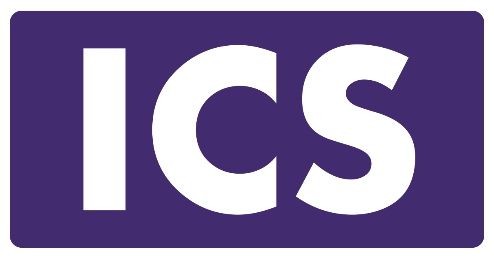

  
  

'[https://www.businesswire.com/news/home/20210407005355/en/ICS-Establishes-Dedicated-Medical-Device-Practice-to-Support-Technology-Driven-Healthcare-Transformation)'

'[https://www.proofhub.com/articles/how-to-improve-teamwork-and-collaboration-skills)'

## What Happened???
Over the course of fall 2022 semester at UH, I took a class called ICS314. It was the first and last ICS class I ever took. Upon missing the first day of class not knowing that the room was below the library, I was very lost. By the time the second day came, I was on time. However, I had no idea there was an online website and discord for the class, thus making me miss my first two assignments. It was only on the second week I was able to catch up and get on gear with the rest of the class. Lucky for me, I didnt miss any tutorials or more important things.

The first thing we went over in class was a review on basic programming and object oriented programming. This was to prep us on what we will be learning the entirety of the semester. Next was a tutorial program on Java, Javascript, and CSS. Using templates, we started to break down and learn what the coding behind it meant. In my opinion, besides all the long tedious and extensive ammount of homework, comes a video by the instructor that walks you through step by step. Many will argue that learning things on your own is better in the long run, but I think that if you are truly stuck and cant find the answer, it's just a waste of time.

The last thing we needed to do this semester was to display what we have learned by compiling a project. This project was a group project meant to simulate working in teams. For our project we used the meteor template to implement a website to help students study. This website allows the user to make quizzes and take them. They can also take other users quizzes but only edit their own. They also get to create a profile taht others can view as well.

This course has taught me many things. This is actually my first time learning Java so I am very grateful for that. I've also learned how to write in HTML and work in an actual team. This team is the first team I got to work with that did not have any inactive members. MOving forward, I hope to build off of this experience and be a better asset to any future teams I work on.
