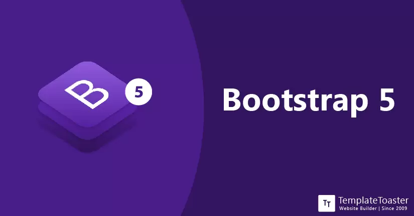

  
  

'https://codeburst.io/25-html-css-tutorials-6a864f387185'

'https://blog.templatetoaster.com/news/bootstrap-5/'

## E37 Reflect On UI Frameworks
Creating webpages is very beneficial to today's society. Any company you work for would need one. With the help of IntelliJ, creating HTML files are much simpler. IntelliJ not only helps you define errors with ESlint, but also creates shortcuts based on what you are typing. For example, typing "
" would cue InteeliJ to create a closing 
 to bracked your next set of code. IntelliJ also uses color code to keep track of these brackets.

Bootstrap5 is an amazing software! Just like ESlint, Bootstrap5 is a program that adds on to you UI Design experience. Bootstrap5 is a a whole package deal that comes with predefined formats and classes. This makes things easier and faster whether you are trying to add spaces or padding, changeing the size of a picture, or even creating things such as a Navbaar.

Overall, while coming into UI Frameworks and designs with no experince, my experince wasn't as laboring as I thought it would be. Although it does take me about an hour to replicate a home page, I find it really interesting how much simpler it is (especially with IntelliJ and Bootstrap5). I'm actually glad I get to learn somehting like this because webpage and UI development is always in demand.
