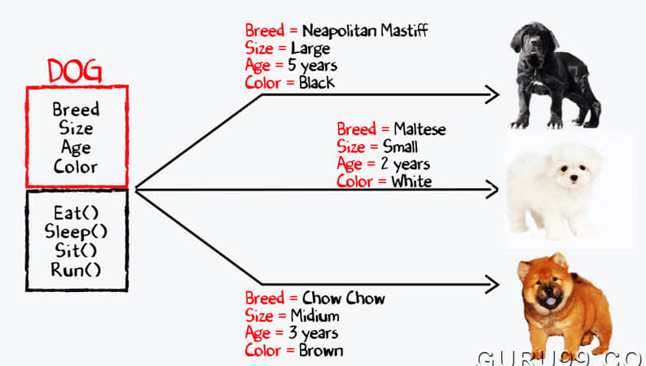

  
  

https://www.roberthalf.com/blog/salaries-and-skills/4-advantages-of-object-oriented-programming
https://www.guru99.com/difference-between-object-and-class.html

Animal farm is a EE205 project at UH Manoa. The purpose of this project is to familiarize myself with object oriented programming with C++. Object oriented programming is a powerful tool that offers many useful tools that C cannot.

For this project, I created my own virtual farm. Using a list of names and a random number generator, I created different classes of animals based on their species. The objects (the animals) were then given properties such as sex, gender, height, weight and so forth. After creating our farm of animals, I decided to formulate loop functions to search for specific objects. For example, in a farm of 100 animals, I wanted to look for a dog named "Scooter". Another thing I did was count how many animals have a specific property.

Overall, I was able to get a basic understanding of object oriented programming. This project used a lot of tools necessary to help me learn about classes and onjects.
