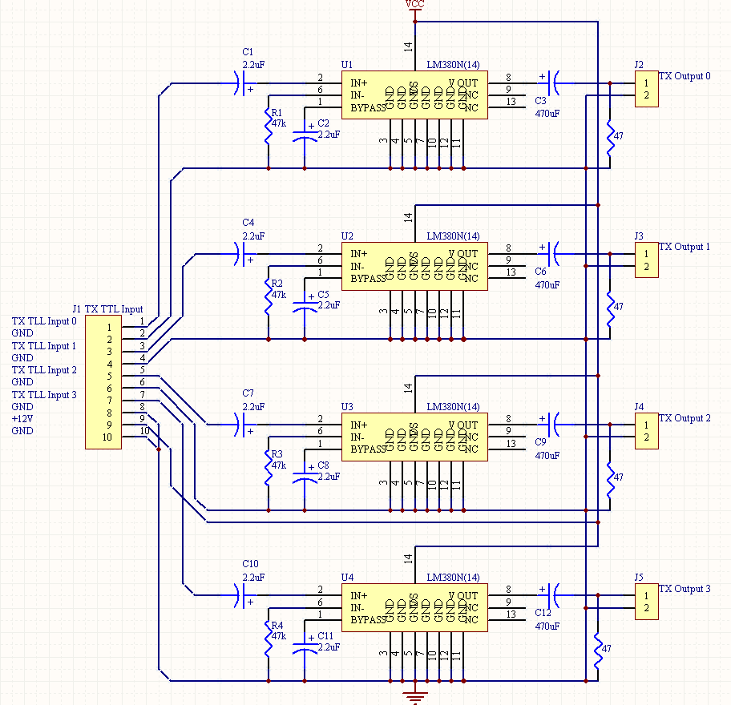

  
  
  

Animal farm is a EE205 project at UH Manoa. The purpose of this project is to familiarize myself with object oriented programming with C++.

For this project, we 

Overall, I was able to get a basic understanding of object oriented programming. This project used a lot of tools necessary to help me learn about classes and onjects.
