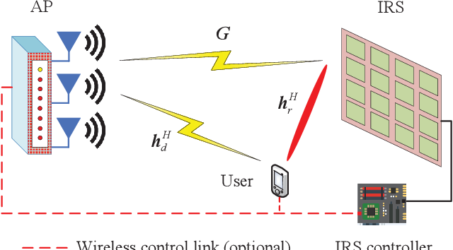
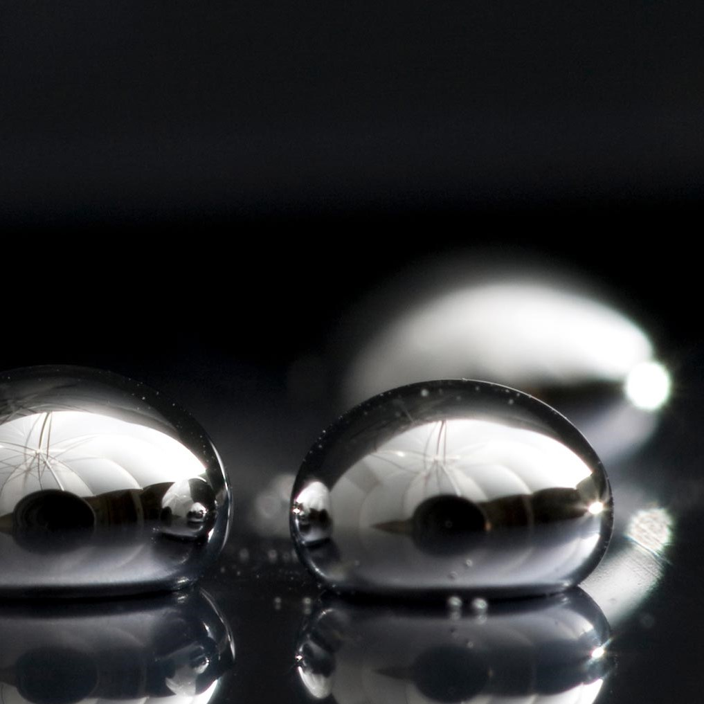

  
  
  

https://www.semanticscholar.org/paper/Intelligent-Reflecting-Surface-Enhanced-Wireless-Wu-Zhang/50910f816336a02b4182468d1cc8c42e8189f24c/figure/0
https://www.forbes.com/sites/bernardmarr/2019/10/25/what-is-5g-technology-and-how-must-businesses-prepare-for-it/?sh=548589f1758b

Modern day internet providers use 2 wifi signals: a higher bandwidth (5G) and a lower bandwidth. Wifi signals normally lose 3DB while passing through the walls of your house. 5G bandwidths use higher frequencies that generally have a shorter range but offer faster speeds. In order to extend the range of these frequencies, we want to create an intelligent reflecting surface (IRS). Utilizing our last project on liquid metal, our team wants to use properties of liquid in order to configure shapes to reflect signals. We will create a rectangular array made of liquid metal. Following a paper from a previous researcher named Wong, we plan to recreate an IRS circuit composed of a 15 x 15 array of unit cells called "elements". These arrays in work together in parallel to produce two state: on and off. The on state will reflect an incident signal with a phase shift of 180.

Some useful applications of the IRS includes strengthening or extending a signal in places that are out of range. For example, there are some dead zones in Hawaii that T-mobile cannot reach. Most rural areas like forests and mountains catches no signals at all. Parkes and recs could also use this to increase tourism. Another great use for an IRS is shopping malls. Malls could use our devices to spread information to specific devices like targeted ads. This could also be used to notify people of emergencies and dangers similiar to airdrop in Iphones.

In the future, we can look at seeing IRS surfaces among the walls of interior designs in many buildings and even homes. Extending 5G frequencios could improve gaming, streaming HDTV and many more experinces. Like all technologies to come, IRS is only meant to improve and increase convenience in our everyday lives. IRS can also be engineered to jam signals and used to fight wars but that will not be our goal.
